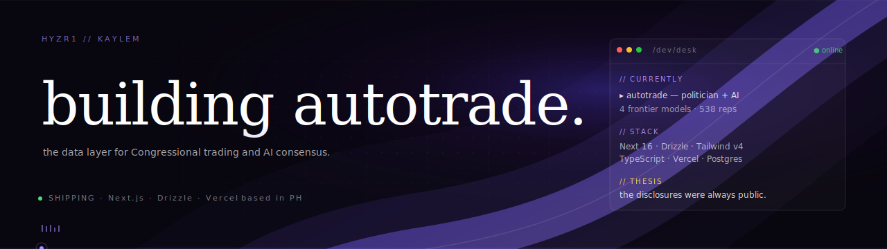

<div align="center">



</div>

<br />

> *the disclosures were always public. the pattern was always there.*

I build premium, data-dense interfaces for things that matter — currently a real-time desk for US Congressional stock trading, weighed against the consensus of four frontier AI models.

<br />

### 🛰 currently shipping

[**autotrade**](https://github.com/hyzr1/autotrader) — the data layer for Congressional trading and AI consensus.

- Every US House & Senate PTR disclosure, ingested daily from the House Clerk feed
- Same prompt → 4 frontier models (GPT-5 · Claude Opus 4.8 · Gemini 2.5 · Grok 4) every Monday at 09:00 ET
- Three full landing variants: **cream editorial** · **dark terminal** · **light Stripe-style**
- Built with: Next.js 16 · Drizzle · Postgres · Tailwind v4 · Vercel

<br />

### 🧰 the desk

```
language   ▸  TypeScript · Python · SQL
frontend   ▸  Next.js · React · Tailwind v4 · Motion · Three.js
backend    ▸  Node · Drizzle ORM · Postgres · Supabase
data       ▸  Yahoo Finance · House Clerk PTR · SEC EDGAR
ai         ▸  GPT-5 · Claude · Gemini · Grok (multi-model consensus)
host       ▸  Vercel (Fluid Compute) · Cron jobs · BotID
```

<br />

### 📈 desk activity

<table>
<tr>
<td valign="top">
<a href="https://github-readme-stats.vercel.app/api?username=hyzr1">
  
</a>
</td>
<td valign="top">
<a href="https://github-readme-stats.vercel.app/api/top-langs?username=hyzr1">
  
</a>
</td>
</tr>
</table>

<br />

### 🎯 approach

```
▸ premium over generic — design with intent, never settle for "default dark template"
▸ data density over decoration — every pixel earns its place
▸ ship & iterate — three landing variants in one weekend, pick what lands
▸ commit to a vision — restrained palette, distinctive type, real product moments
```

<br />

### 📡 reach

<p>
  <a href="https://github.com/hyzr1"></a>
  &nbsp;
  <a href="mailto:kaylem312@gmail.com"></a>
</p>

<br />

<sub><i>this profile is hand-built in the same visual language as <a href="https://github.com/hyzr1/autotrader">autotrade</a> — warm-black, violet brand gradient, dot-matrix surface, restraint over decoration.</i></sub>
