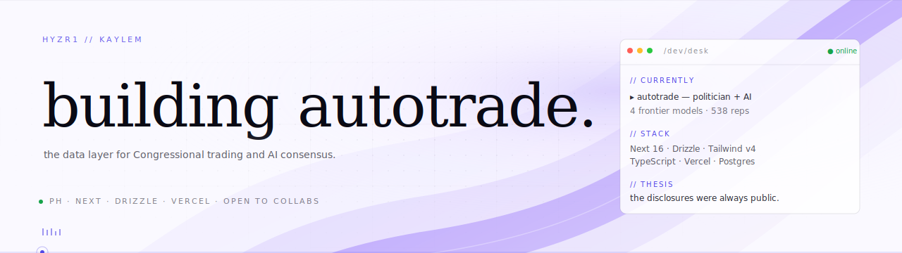

<div align="center">



</div>

<br />

> *the disclosures were always public. the pattern was always there.*

I build premium, data-dense interfaces for things that matter — currently a real-time desk for US Congressional stock trading, weighed against the consensus of four frontier AI models.

<br />

### 🛰 currently building

**autotrade** — the data layer for Congressional trading and AI consensus *(private, in active development)*

- Every US House & Senate PTR disclosure ingested daily from the House Clerk feed
- Same prompt → 4 frontier models (GPT-5 · Claude Opus 4.8 · Gemini 2.5 · Grok 4) every Monday at 09:00 ET
- Three full landing variants: **cream editorial** · **dark terminal** · **light Stripe-style**
- Built with: Next.js 16 · Drizzle · Postgres · Tailwind v4 · Vercel Fluid Compute

<br />

### 📦 selected open source

<table>
  <tr>
    <td width="50%">
      <a href="https://github.com/hyzr1/hyzrUI">
        
      </a>
    </td>
    <td width="50%">
      <a href="https://github.com/hyzr1/hyperGL">
        
      </a>
    </td>
  </tr>
  <tr>
    <td width="50%">
      <a href="https://github.com/hyzr1/project-spark">
        
      </a>
    </td>
    <td width="50%">
      <a href="https://github.com/hyzr1/portfolio">
        
      </a>
    </td>
  </tr>
</table>

> **hyzrUI** ▸ 60+ source-first React primitives, token-driven theming, light + dark.
> **hyperGL** ▸ customizable WebGL effects library with live documentation.
> **project-spark** ▸ encrypted lecture vault, AES-128 HLS — useless without the key.
> **portfolio** ▸ personal portfolio site.

<br />

### 🔭 also in the kitchen

A handful of private projects exploring different problem spaces:

- **pluto** — real-time gamma exposure, dealer positioning, volatility surfaces across every strike and expiration. 30+ views, one workspace.
- **hyzrAI** — AI-powered platform letting businesses spin up custom web apps from scratch or fully customizable templates.
- **saka** & **sparkzy-vault** — encrypted lecture vault systems, AES-128 HLS streaming.

<br />

### 🧰 the desk

```
language   ▸  TypeScript · Python · SQL
frontend   ▸  Next.js · React · Tailwind v4 · Motion · Three.js · GSAP
backend    ▸  Node · Drizzle ORM · Postgres · Supabase
data       ▸  Yahoo Finance · House Clerk PTR · SEC EDGAR
ai         ▸  GPT-5 · Claude · Gemini · Grok (multi-model consensus)
host       ▸  Vercel (Fluid Compute) · Cron jobs · BotID
```

<br />

### 📈 desk activity

<table>
<tr>
<td valign="top">
<a href="https://github-readme-stats.vercel.app/api?username=hyzr1">
  
</a>
</td>
<td valign="top">
<a href="https://github-readme-stats.vercel.app/api/top-langs?username=hyzr1">
  
</a>
</td>
</tr>
</table>

<br />

### 🎯 approach

```
▸ premium over generic — design with intent, never settle for "default dark template"
▸ data density over decoration — every pixel earns its place
▸ ship & iterate — three landing variants in one weekend, pick what lands
▸ commit to a vision — restrained palette, distinctive type, real product moments
```

<br />

### 📡 reach

<p>
  <a href="https://github.com/hyzr1"></a>
  &nbsp;
  <a href="mailto:kaylem312@gmail.com"></a>
</p>

<br />

<sub><i>this profile is hand-built in the same visual language as autotrade's light variant — warm cream surface, violet brand ribbon, dark-on-light dot matrix, restraint over decoration.</i></sub>
